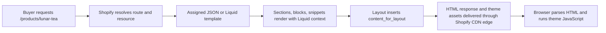

<!-- STATUS: draft -->
---
id: ch-01
title: "Where Liquid Actually Sits"
part: 1
words: 2255
---

# Chapter 1 — Where Liquid Actually Sits

Most expensive theme mistakes begin with a category error: treating Liquid as a browser framework that happens to use curly braces. It is neither a browser runtime nor a general server runtime. Shopify invokes Liquid as a constrained template language while producing a storefront response, hands it a documented data context, turns the result into HTML, and then sends that response toward the buyer. Once you know where that execution ends, the “missing” APIs stop looking arbitrary and become an architectural boundary you can design around.[1]

## What you’ll be able to do

- Place a requirement in Liquid, browser JavaScript, a Shopify Function, or a headless storefront deliberately.
- Trace a storefront request from route resolution to the HTML that reaches a buyer.
- Explain why a theme render cannot make a runtime network request or import an npm package.
- Choose Liquid or Hydrogen/Oxygen from delivery and ownership constraints rather than fashion.

---

## 1.1 Liquid is not a frontend framework — it's a sandboxed server-side template language

Liquid receives a context and emits text, usually HTML. A product template can render a different product from the same source because Shopify supplies a different `product` object for each request. Tags add control flow, filters transform values, and objects expose the data Shopify chooses to make available. That is the full model: **render a supplied data graph into a response**.[1]

A frontend framework owns a long-lived client runtime: component state, network calls, module resolution, hydration, and browser event handling. Liquid owns none of those. It runs before the browser receives the document and is finished when Shopify has rendered the template. The JavaScript you ship afterwards is separate code with a separate runtime and separate capabilities.

| Capability | Liquid theme render | Browser JavaScript |
|---|---|---|
| Runtime | Shopify server during a render | Buyer’s browser after response delivery |
| Data source | Documented Liquid objects and settings | DOM, browser APIs, approved network endpoints |
| Output | HTML, text, JSON embedded in HTML | DOM changes, client state, requests, interactions |
| State lifetime | One render | Page lifetime and browser storage where used |
| Dependency model | Theme files and Liquid tags/filters | Bundled/imported JavaScript dependencies |

```liquid
<!-- sections/main-product.liquid -->
<article class="product" data-product-id="{{ product.id }}">
  <h1>{{ product.title }}</h1>
  <p>{{ product.price | money }}</p>
</article>
```

Shopify resolves `product` for the product-template request, renders the HTML, and sends the literal price text. The buyer’s browser receives no `product` Drop and cannot resume that Liquid expression. The browser only sees the resulting DOM.

> **Boundary:** Liquid is server-side presentation code with a Shopify-defined context. It is not React without JSX, Node without packages, or an HTTP client with unusual syntax.

## 1.2 The request lifecycle: request → route resolution → template → layout → CDN edge

A request such as `/products/lunar-tea` enters Shopify’s storefront delivery path. Shopify resolves the route and product resource, selects the assigned template, renders its sections and snippets with the request-specific Liquid context, places the result inside a layout, and delivers the completed response through Shopify’s delivery infrastructure. A theme contributes template source and assets; it does not own the request server.



The layout boundary is visible in every ordinary theme:

```liquid
<!-- layout/theme.liquid -->
<!doctype html>
<html lang="{{ request.locale.iso_code }}">
  <head>
    {{ content_for_header }}
  </head>
  <body>
    {{ content_for_layout }}
  </body>
</html>
```

`content_for_layout` is the server-rendered content selected by the route and template; it is not a client-side outlet. In a JSON template, Shopify uses the template’s serialized section configuration to choose and configure sections. In a Liquid template, the template source determines the composition. Both paths eventually supply rendered content to the layout.

This ordering matters for performance work. Liquid can choose markup and responsive asset URLs before the browser parses the page. Browser JavaScript can enhance that markup afterwards, but it cannot retroactively cause the initial Liquid render to read a different request object. For request-specific storefront data, start with the template object Shopify already supplies; Appendix C maps those contexts in detail.

## 1.3 What runs where: Liquid (server, per render) vs JS (browser) vs Functions (Wasm) vs Storefront API (headless)

These technologies are complementary, not interchangeable. A useful question is: **which system owns the decision, and when must it run?**

| Need | Use | Where it runs | What it can do |
|---|---|---|---|
| Render a product title, collection grid, menu, setting, or template-specific HTML | Liquid | Shopify during page render | Read documented theme objects and produce response markup |
| Open a drawer, update the DOM, handle an interaction, call an approved browser endpoint | JavaScript | Buyer’s browser | Use DOM and browser APIs after delivery |
| Apply a discount, alter a delivery/payment decision, validate cart/checkout behavior, or implement a commerce rule at a supported target | Shopify Function | Shopify backend at an invoked Function target | Consume its declared GraphQL input and return supported JSON operations compiled to WebAssembly [2] |
| Build a custom web, mobile, game, or non-Liquid storefront | Storefront API | Your client/server/headless runtime | Query and mutate commerce data through GraphQL [3] |
| Operate Shopify’s recommended headless web stack | Hydrogen + Oxygen | React Router app and Shopify edge hosting | Use Storefront API clients, SSR, server loaders, caching, environment settings, and deployment tooling [4] |

A Function is not a button-click callback from your theme. Shopify invokes Functions as needed at their configured targets; a Function cannot be called directly by URL. It has a declared GraphQL input, WebAssembly logic, and a JSON output describing operations Shopify may perform.[2] That makes it appropriate for supported commerce decisions, not for emitting a custom product-card DOM fragment.

Likewise, the Storefront API is not “Liquid with `fetch`.” It is GraphQL for custom storefront experiences. It requires you to own queries, API versions, token choice, cache behavior, rendering, and the frontend runtime. Tokenless access covers a defined essential surface, while other data such as customer data, menus, and metafields needs token-based access.[3]

```ts
// app/routes/products.$handle.tsx — Hydrogen/React Router server loader
const PRODUCT_QUERY = `#graphql
  query Product($handle: String!) {
    product(handle: $handle) {
      title
      handle
    }
  }
`;

export async function loader({context, params}) {
  return context.storefront.query(PRODUCT_QUERY, {
    variables: {handle: params.handle},
  });
}
```

That code is valid in a Hydrogen application because its server runtime owns an API client and an asynchronous loader. The corresponding Liquid theme render has neither of those runtime facilities.

## 1.4 Why there is no `fetch`, no `await`, no imports, no npm at render time

Liquid deliberately has no ambient network API, promise scheduler, module loader, package manager, filesystem, process environment, or arbitrary code evaluation. A theme render reads Shopify-provided objects and theme settings, then emits output. It does not execute an application server under your control.

**Wrong boundary:** asking a Liquid render to invent a live external-data capability.

```liquid
<!-- sections/shipping-estimator.liquid — wrong design: do not add this -->

  Liquid has no fetch(), await, import, or npm runtime. A theme render cannot call
  an external shipping endpoint here.

```

**Right boundary:** render a stable server-side shell, then let browser JavaScript call a purpose-built endpoint if the interaction genuinely needs fresh client-side data.

```liquid
<!-- sections/shipping-estimator.liquid -->
<div class="shipping-estimator" data-estimator>
  <label for="shipping-postcode-{{ section.id }}">Postcode</label>
  <input id="shipping-postcode-{{ section.id }}" name="postcode" inputmode="numeric">
  <p data-estimator-result aria-live="polite"></p>
</div>
{{ 'shipping-estimator.js' | asset_url | script_tag }}
```

```js
// assets/shipping-estimator.js
for (const estimator of document.querySelectorAll('[data-estimator]')) {
  const input = estimator.querySelector('input');
  const result = estimator.querySelector('[data-estimator-result]');

  input.addEventListener('change', async () => {
    result.textContent = 'Checking delivery options…';
    // Call an endpoint designed and authorized for this browser interaction.
  });
}
```

The missing Liquid features prevent several common failures: one visitor’s request cannot make arbitrary server calls on behalf of every render; a merchant cannot turn a schema field into server-side executable code; and a theme cannot silently acquire arbitrary dependencies that change Shopify’s render behavior. Put a networked decision in an app, a browser enhancement, a Function target, or a headless server according to its owner.

## 1.5 The sandbox as a feature: multi-tenancy, upgrade safety, and why Shopify locks you down

Shopify renders themes for many shops through a shared platform. The sandbox gives themes a stable contract: documented objects, tags, filters, schemas, and delivery paths. The cost is reduced freedom; the benefit is that a theme cannot reach into the host process, open arbitrary sockets, install packages during a render, or depend on an undocumented server implementation.

That constraint also supports upgrade safety. Shopify can change its delivery and internal implementation while preserving the documented Liquid contract. Your theme should therefore target public objects and APIs, not DOM IDs generated by the editor, undocumented response shapes, or historical checkout surfaces. The chapter on deprecations is not bureaucracy: it is the ledger of contracts that no longer carry that guarantee.

The trap is treating the sandbox as a temporary inconvenience and building around it with brittle workarounds. If a component needs authoritative commerce logic, use a supported Function target. If it needs a rich, bespoke application runtime, choose a headless storefront. If it needs configurable storefront markup built around Shopify’s native commerce and editor, Liquid is the advantage, not the compromise.

## 1.6 Liquid Storefronts vs Hydrogen/Oxygen — the honest decision matrix

Liquid and Hydrogen both deliver storefront HTML, and both can be fast. The difference is the amount of application architecture you own. A Liquid theme gives you Shopify’s native template, theme-editor, routing, and merchandising model. Hydrogen is a React Router application with Shopify utilities and API clients; Oxygen is Shopify’s edge hosting platform for that headless stack.[4]

| Constraint | Prefer Liquid theme | Prefer Hydrogen/Oxygen |
|---|---|---|
| Merchant changes sections, blocks, and settings daily | Yes — native theme editor is the operating surface | Only if you deliberately rebuild or constrain that workflow |
| Storefront follows conventional Shopify routes and commerce patterns | Yes — route/template/data context is supplied | Usually unnecessary complexity |
| Team needs a bespoke application composition model, server loaders, or API-orchestration ownership | Limited by theme runtime | Yes — this is the headless operating model |
| A custom client, mobile app, game, or non-web surface consumes commerce data | No | Storefront API, with or without Hydrogen for web |
| Team can own GraphQL query design, token policy, API versioning, server/runtime deployment, and cache strategy | Shopify owns most of this for themes | Required for headless success |
| Requirement is a discount, delivery, payment, or checkout rule | Neither as the primary answer | Use the appropriate Shopify Function or extension target |

Do not choose Hydrogen because you want one interactive component. Liquid plus purposeful JavaScript is normally the smaller and more merchant-operable system. Do not choose Liquid when the product requirement is fundamentally a custom application runtime or a multi-surface API client. The honest choice is the one that places the runtime ownership where your requirements already are.

---

## Gotchas

- **“Server-side” does not mean “my server.”** Liquid runs during Shopify’s render, but themes do not receive a general Node, Ruby, or serverless runtime.
- **A Liquid object is context-dependent.** `product` on a product template is not a global product-query API. Check object availability before designing a reusable section.
- **Browser JavaScript is not a backdoor into Liquid.** It can enhance rendered HTML and call approved endpoints, but it cannot resume a completed Liquid render.
- **Functions do not render storefront markup.** They execute supported commerce logic at Shopify-defined targets.
- **Headless changes responsibility, not only syntax.** Storefront API queries, auth, versioning, caching, deployment, and route behavior become part of your application surface.
- **Do not use retired checkout Liquid as an escape hatch.** Checkout customization follows Checkout Extensibility; the retired checkout surfaces are recorded in `docs/DEPRECATIONS.md`.

---

## Checklist

- [ ] I can point to the runtime that owns each requirement: Liquid, browser JavaScript, Function, or headless application.
- [ ] I can trace a storefront request through route, template, sections, layout, delivery, and browser enhancement.
- [ ] I do not expect Liquid to make arbitrary HTTP requests, await promises, or load npm dependencies at render time.
- [ ] I can state which new responsibility appears when I choose a Storefront API or Hydrogen storefront.
- [ ] I choose a Function for supported commerce rules, not for theme HTML.

## Related

- [Appendix A — Complete Liquid Tag Reference](../../part-15-appendices/appendix-a-complete-liquid-tag-reference/): tags and output syntax.
- [Appendix C — Complete Object Reference](../../part-15-appendices/appendix-c-complete-object-reference/): object availability and access context.
- [Chapter 2 — The Four Surfaces](../ch-02-the-four-surfaces/): the concrete surfaces on which the runtimes meet.
- [Chapter 3 — The Shopify Object Graph](../ch-03-the-shopify-object-graph/): the request-scoped object graph in depth.
- [Chapter 5 — Your First Render](../ch-05-your-first-render/): the first implementation pass on template output.

## References

[1]: https://shopify.dev/docs/api/liquid "Shopify — Liquid reference"
[2]: https://shopify.dev/docs/apps/build/functions "Shopify — About Shopify Functions"
[3]: https://shopify.dev/docs/api/storefront/latest "Shopify — GraphQL Storefront API"
[4]: https://shopify.dev/docs/storefronts/headless/hydrogen/fundamentals "Shopify — Hydrogen and Oxygen fundamentals"
